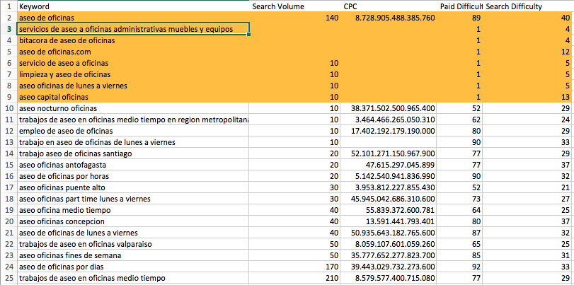
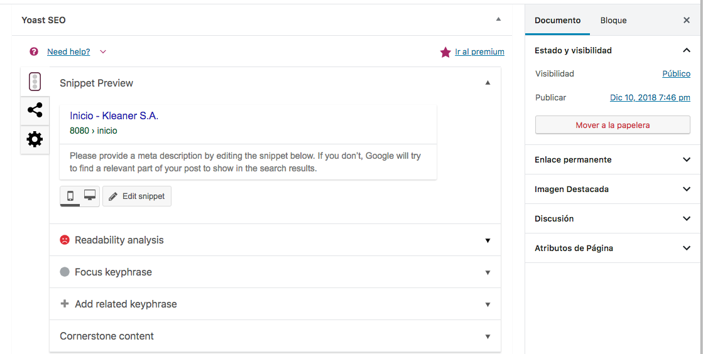
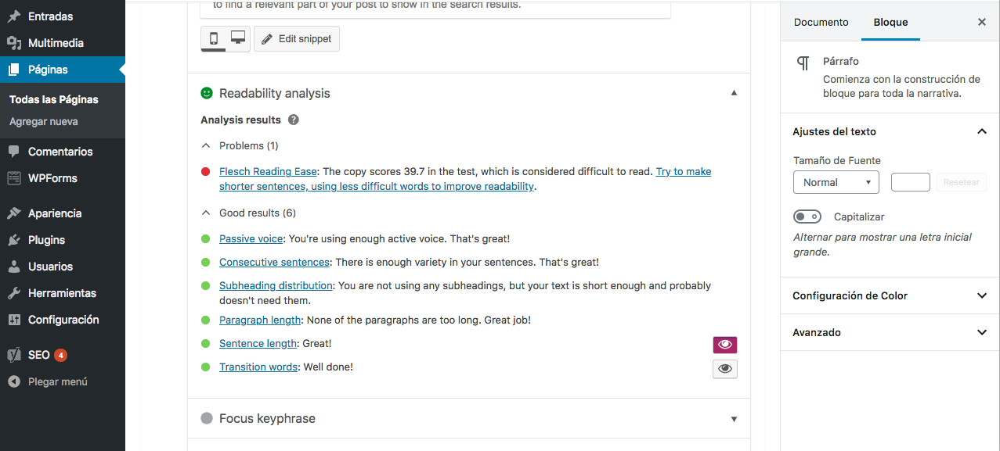
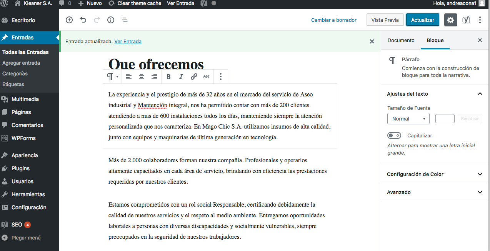
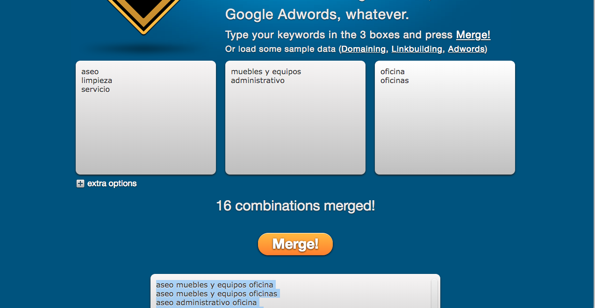

1. Buscar el publico objetivo

Publico objetivo: Medianas y grandes empresas que no quieren contratar personal de aseo

2. Buscar keywoards en ubersigguest, para luego llevarlas al exel  (solo las palabras con menor puntuación longtail), las keywoards que no ajustaban a la empresa fueron eliminadas.

3.  Luego en la pagina http://mergewords.com/ combinamos las palabras claves obtenidas en Ubersigguest.

Imágenes:

